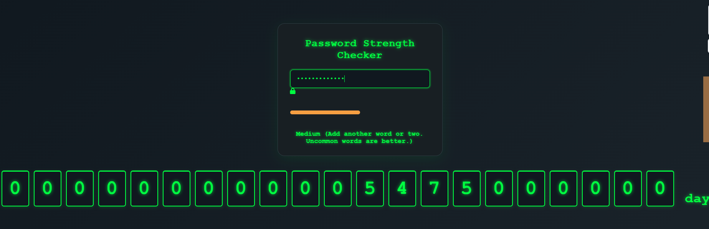

# Password Strength Checker 🔒💻

A hacker-themed password strength checker web app featuring:

- **Real-time password strength analysis** using [zxcvbn](https://github.com/dropbox/zxcvbn)
- **Animated odometer-style counter** showing estimated crack time in days
- **Dark, neon-green "hacker" interface** inspired by classic terminals
- **Responsive design** for desktop and mobile

## Demo

## Features

- Password strength meter with suggestions
- Odometer animation for crack time (up to 21 digits)
- Instant feedback for weak/strong/too-long passwords
- Fully client-side, no backend required

## Usage

Just open `index.html` in your browser, or [deploy it online](https://pages.github.com/)!

## Deploy

You can easily publish this site using [GitHub Pages](https://pages.github.com/), [Netlify](https://netlify.com/), or [Vercel](https://vercel.com/).

---

**Built with ❤️ by Bhupendra**
